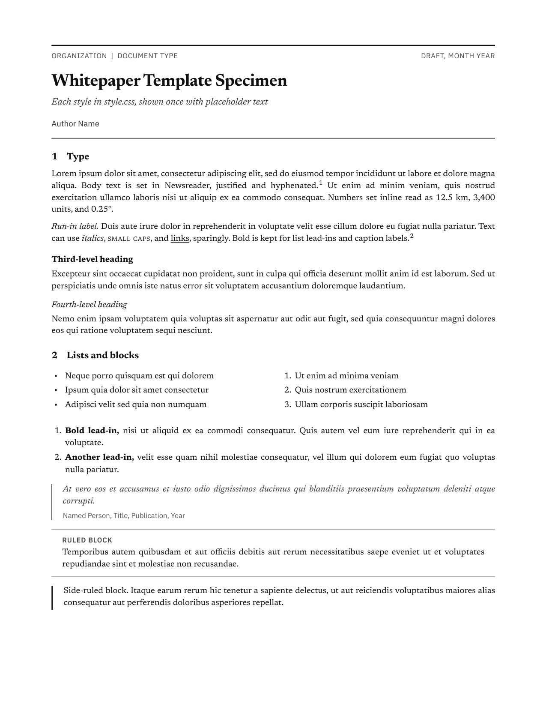
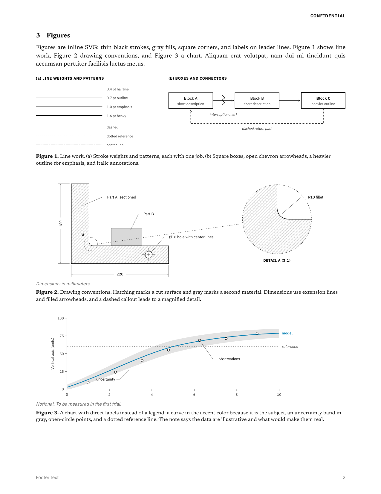

# Whitepaper template

A grayscale print stylesheet for writing documents in HTML and printing them to PDF, with a specimen page that shows each style once. Use it for papers, reports, memos, notes, or anything else that ends up as a PDF.





The full specimen is [specimen.pdf](specimen.pdf).

## Files

| File | Purpose |
|---|---|
| `style.css` | The stylesheet. Page size, margins, footer, type, tables, and figure styles. |
| `specimen.html` | Every style shown once with placeholder text. Copy from it as needed. |
| `build.sh` | Prints an HTML file to PDF and writes page previews. |
| `SKILL.md` | The guide an AI follows to write and typeset a document in this style. |
| `check.py` | Checks a document against the guide: color, fonts, figure numbering, punctuation, AI tells, stranded headings. |
| `examples/` | A complete whitepaper written to the guide. |

## Use

Link the stylesheet from your own HTML file and write the document in plain HTML:

```html
<link rel="stylesheet" href="style.css">
```

Then print it:

```sh
./build.sh my-document.html
```

`build.sh` needs Chrome or Chromium. Page previews in `preview/` need `pdftoppm` (Poppler). Fonts (Newsreader, IBM Plex Sans, IBM Plex Mono and STIX Two Math) load from Google Fonts, so printing needs a network connection. Set `CHROME` to use a particular browser binary. Page size, margins, and footer text are set in the `@page` rule at the top of `style.css`.

Figures are inline SVG, which keeps them editable as text and sharp in the PDF. The specimen's figures show line weights, arrowheads, hatching, dimensions, callouts, a detail view, and a chart.

## Styles

| Class or element | Use |
|---|---|
| `.titleblock` with `.meta`, `h1`, `.subtitle`, `.byline` | Title block |
| `h1` to `h4`, optional `<span class="n">` | Headings, with an optional hanging number |
| `.runin` | Italic run-in label at the start of a paragraph |
| `.smallcaps` | Small capitals |
| `sup.fn` and `.notes` | Note markers and the notes list |
| `ol.lead` | Numbered list with bold lead-ins |
| `blockquote` with `.source` | Quotation and attribution |
| `.ruled` with `.label` | Block set between two rules |
| `.sidebar` | Block set off with a left rule |
| `table`, `td.num`, `td.icon`, `caption`, `.legend` | Ruled tables, numeric columns, icon columns, captions, legends |
| `table.keep`, `.keep` | Keep a short table or block on one page |
| `.summary`, `.opener` | Summary under the title, alone or beside a first-page figure |
| `figure`, `figcaption`, `.note` | Figures, captions, and a small italic note such as "Not to scale." |
| `figure.right`, `.figrow` | A figure floated beside the text; figures side by side or small multiples |
| `.eq`, `.eqn` | Display equations in MathML, numbered at the right |
| `code`, `pre` | Inline code and code blocks |
| `table.rating` | Harvey-ball matrix with centered columns |
| `.part`, `.appendix` | The "Appendices" part title and lettered appendices, each on a new page |
